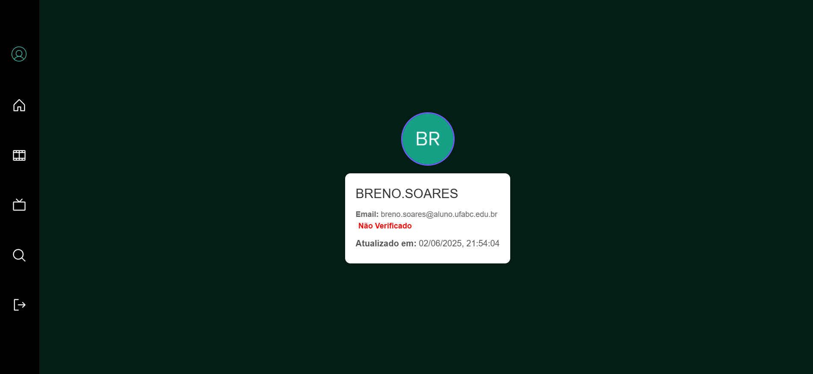
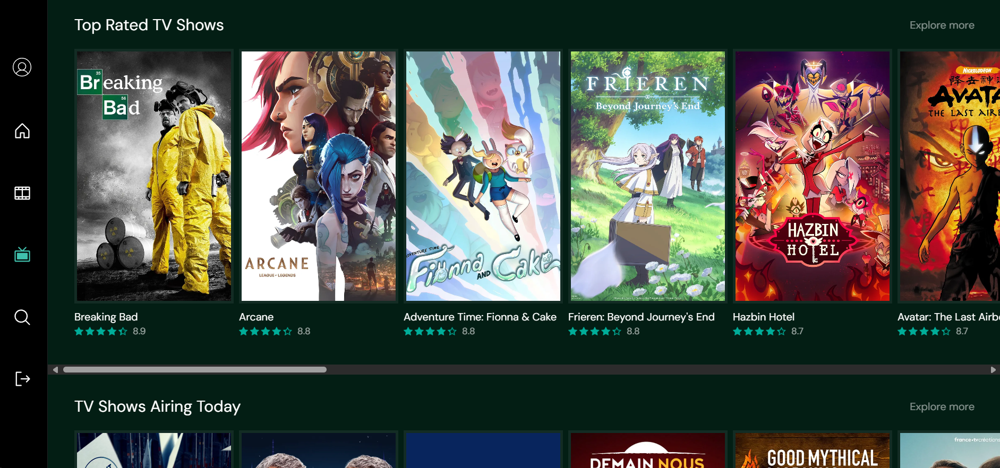
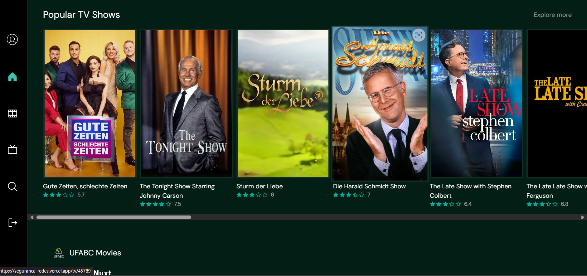

<br><p align="center">

</p>

<h1 align="center">Nuxt Movies</h1>
<br>

> Movies app demo built using [Nuxt 3](https://github.com/nuxt/nuxt), [Vue 3](https://github.com/vuejs/core), [UnoCSS](https://github.com/unocss/unocss), [Image Module](https://v1.image.nuxtjs.org), [The Movie Database](https://www.themoviedb.org) [API](https://www.themoviedb.org/documentation/api) and [TypeScript](https://github.com/microsoft/TypeScript).

**🍿 Live preview:** https://seguranca-redes.vercel.app

## Screenshots






## Proxy Server

Check [proxy/README](./proxy)

## Setup

``` bash
# Enable pnpm
$ corepack enable

# Install dependencies
$ pnpm install

# Start dev server with hot reload at localhost:3000
$ pnpm dev
```

## Credits

Based on [jasonujmaalvis/vue-movies](https://github.com/jasonujmaalvis/vue-movies) and [tastejs/nuxt-movies](https://github.com/tastejs/nuxt-movies).


Data provided by [The Movie Database](https://www.themoviedb.org).

This project uses the TMDB API but is not endorsed or certified by TMDB.
